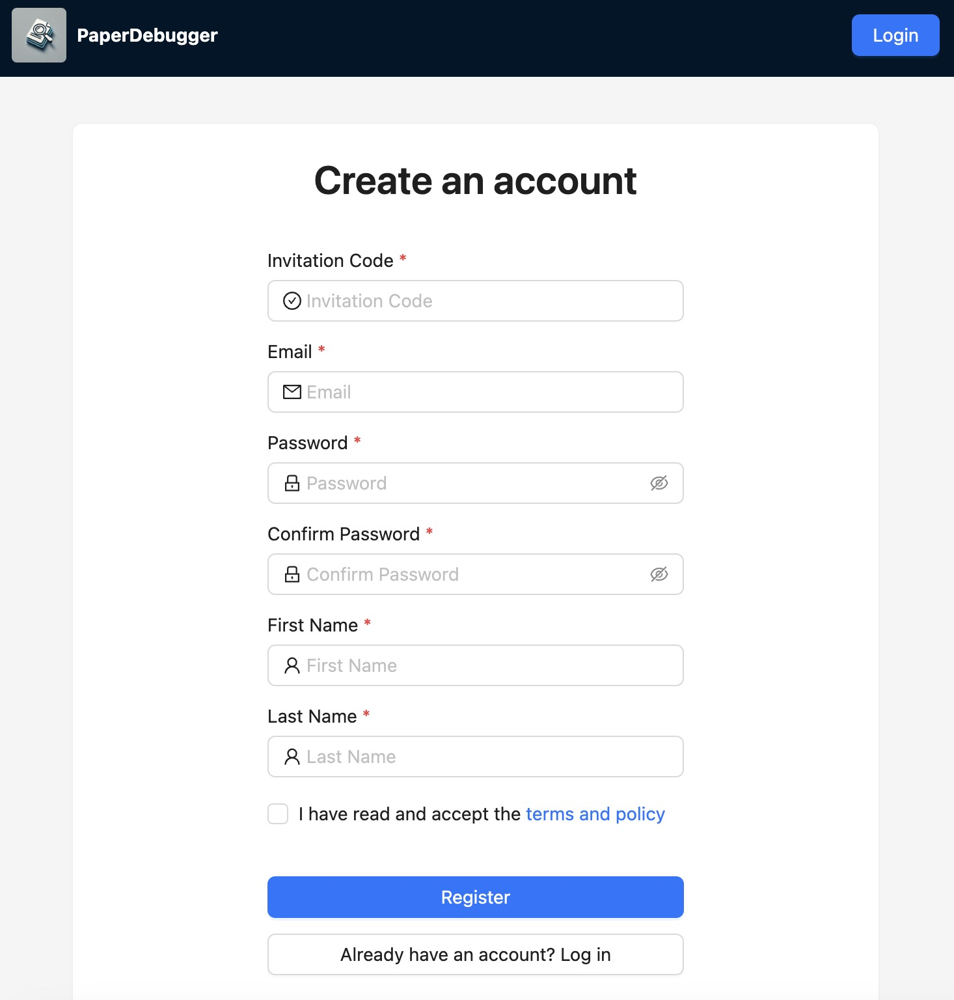
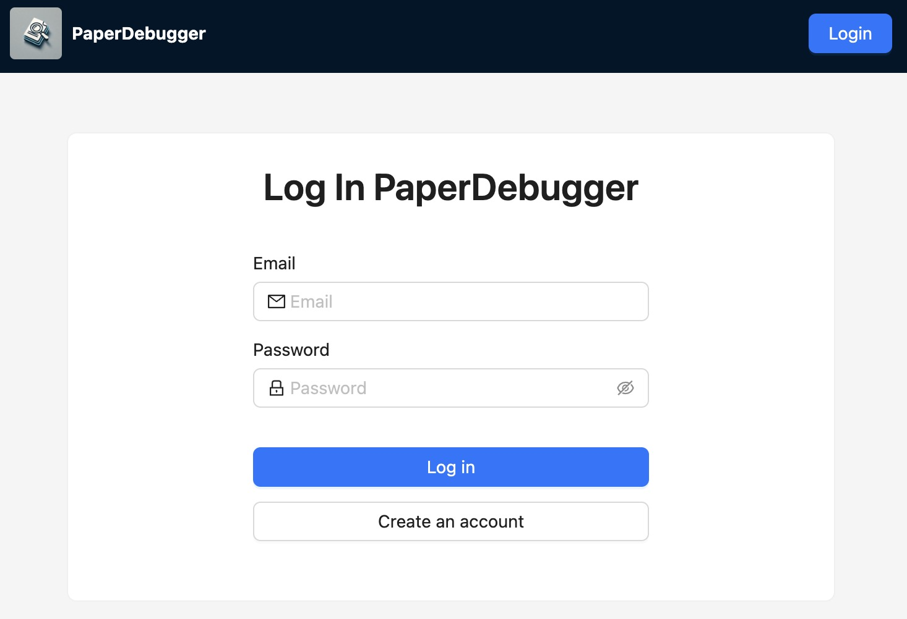
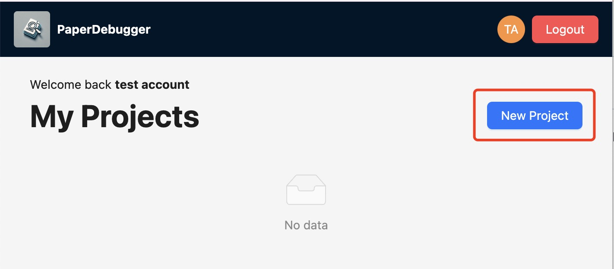
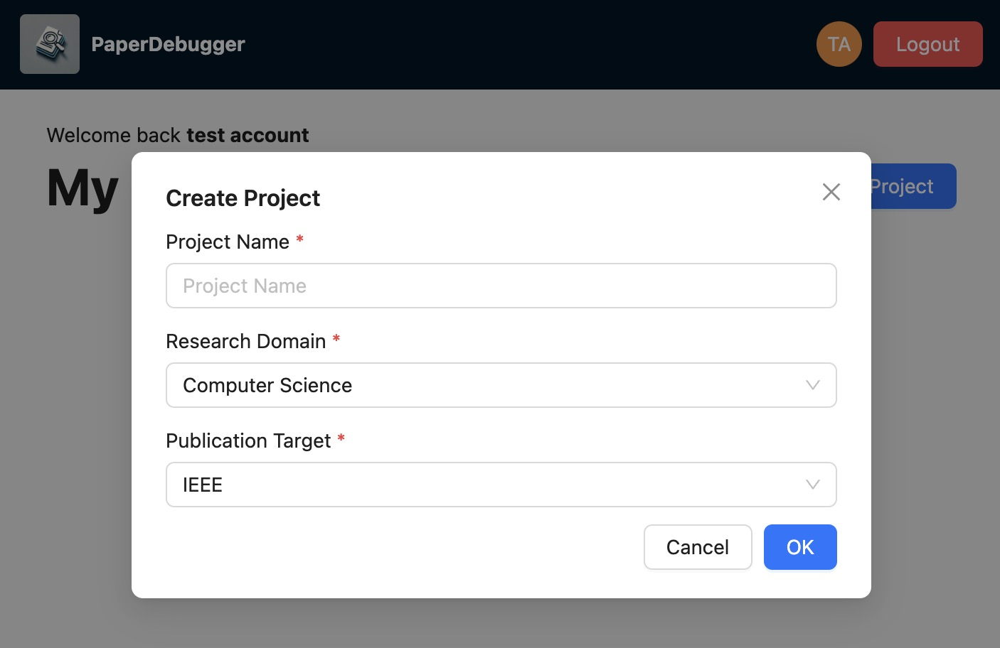
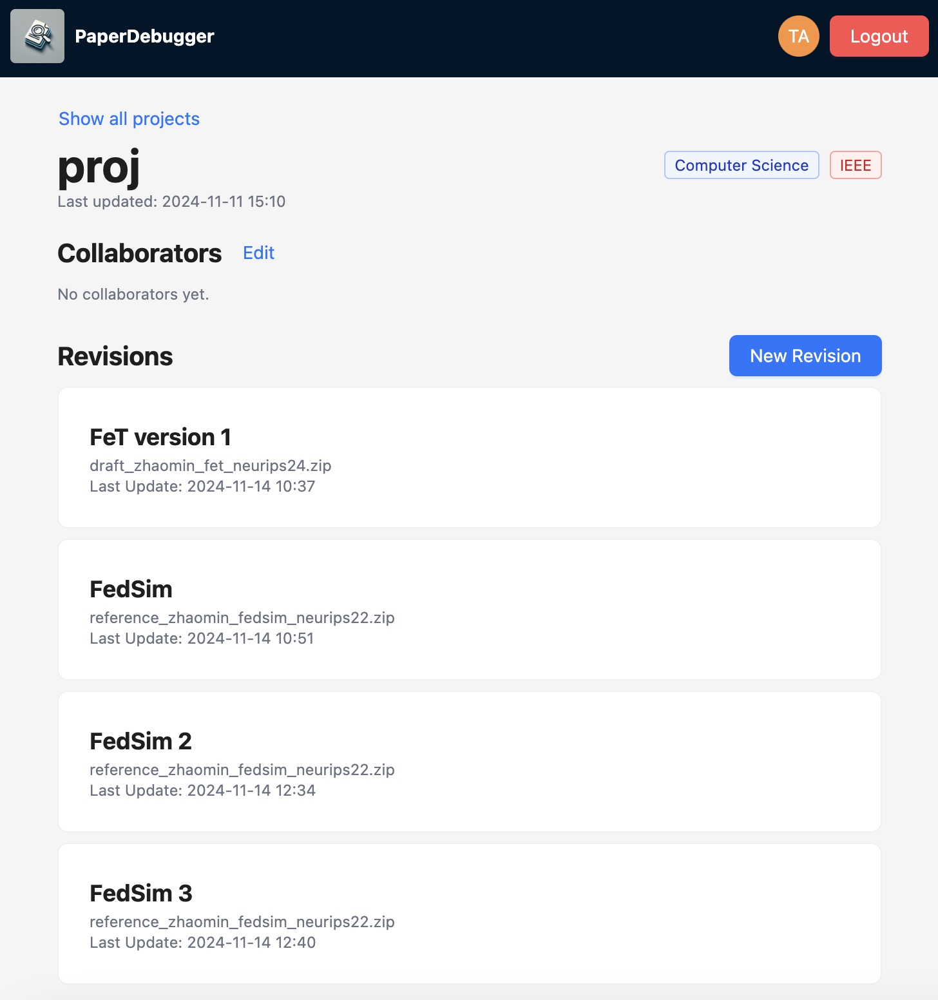
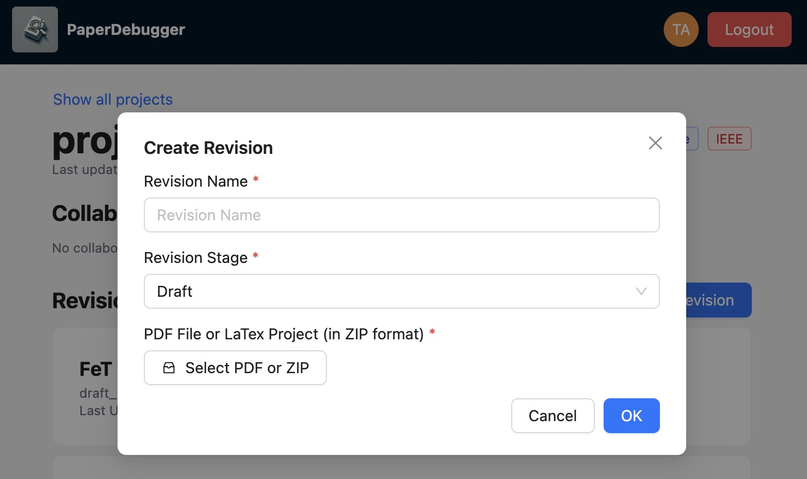
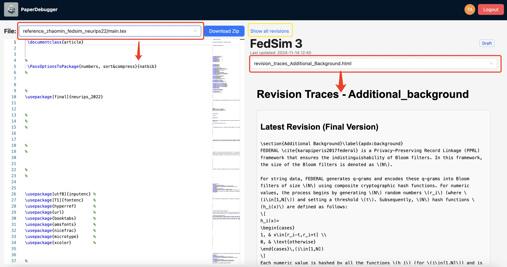

# user-manual

Welcome to **Paper Debugger**, your comprehensive solution for academic paper review and language polishing. This user manual provides detailed instructions on how to utilize our platform's features and get started efficiently.

## Table of Contents

1. [Introduction](#introduction)
   - [General Review](#1-general-review)
   - [Comprehensive Polishing and Language Editing](#2-comprehensive-polishing-and-language-editing)
2. [Getting Started](#getting-started)
   - [Register & Login](#register--login)
   - [Project](#project)
   - [Revision](#revision)
   - [View Result](#view-result)
3. [Feedback & Incentive Scheme](#feedback--incentive-scheme)
4. [Support](#support)

## Introduction

**Paper Debugger** is dedicated to assisting students and researchers in enhancing the quality of their academic papers. Our platform offers specialized services that provide constructive feedback and comprehensive language editing. We currently offer the following services:

### 1. General Review

Provides suggestions and evaluations based on the style of your submitted paper.

- **Duration:** Approximately 10 minutes per paper
- **Features:**
  - Style and structure analysis
  - High-level feedback on content relevance
  - Recommendations for improvement

### 2. Comprehensive Polishing and Language Editing

Identifies and corrects the 30 most common writing mistakes made by Chinese students.

- **Duration:** Approximately 30 minutes per paper
- **Features:**
  - Grammar and syntax correction
  - Vocabulary enhancement
  - Clarity and coherence improvements

## Getting Started

### Register & Login

1. **Navigate to the Homepage**

   Visit our website at [https://app.paperdebugger.com/](https://app.paperdebugger.com/).

2. **Register**

   Click on **"Create an account"**. Complete the registration form by entering your details and the **"Invitation Code"**, then click on the **"Register"** button to create your account.

   

3. **Login to Your Account**

   Use your registered email and password to log in.

   

### Project

1. **Access Dashboard**

   After logging in, you will be directed to your dashboard.

   

2. **Create a New Project**

   Click on **"New Project"** from the homepage and fill in the project details. Then, click **"OK"** to proceed.

   *Note: We are working on utilizing the "Research Domain" and "Publication Target" fields to better cater to various paper domains.*

   

### Revision

Once you create a project, you can create multiple revisions to utilize our services at different stages of your paper's life cycle.

1. **Revision List**

   Below is an example of the revision history for the selected project named "proj":

   

2. **Create a Revision**

   Click **"New Revision"** to create a new revision. Here, you can choose the service you desire (General Review or Comprehensive Polishing and Language Editing). You will need to upload your paper in either PDF or zipped LaTeX format to proceed.

   

### View Result
1. Navigate to the **"Revision List"**. Click on a specific revision to view detailed results:
2. Use the top-left dropdown menu to view your uploaded files;
3. Use the top-right dropdown menu to access our detailed feedback.
4. Click on **"Show all revisions"** to return to the **"Revision List"**.

   

## Feedback & Incentive Scheme

We highly value your feedback and offer incentives for your contributions:

- **Submit Feedback Within 72 Hours:** Provide your feedback within 72 hours of receiving our review.
- **Earn Additional Credits:** Upon verifying the value of your feedback, you will receive an additional **5 credits**.

To submit your feedback:

- Click on **"Provide Feedback"** in your project dashboard.
- Complete the feedback form detailing your experience.

   

## Support

For any questions or assistance, please contact us:

- **Email:** [?????????support@paperdebugger.com](mailto:support@paperdebugger.com)

---

*Thank you for choosing **Paper Debugger**. We are committed to helping you achieve academic excellence.*
